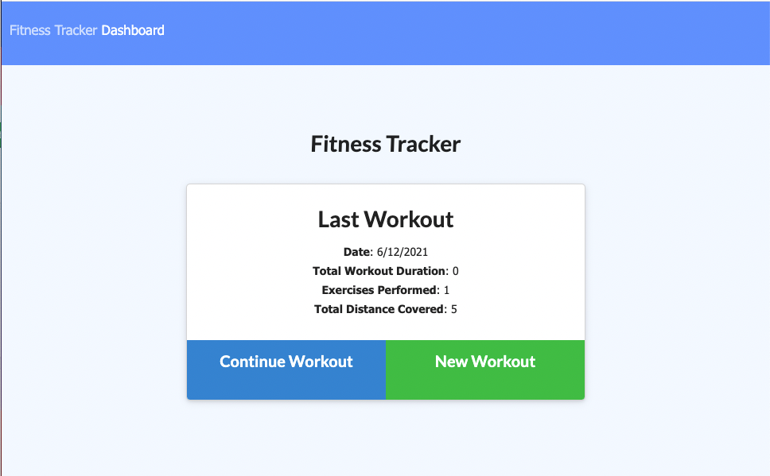
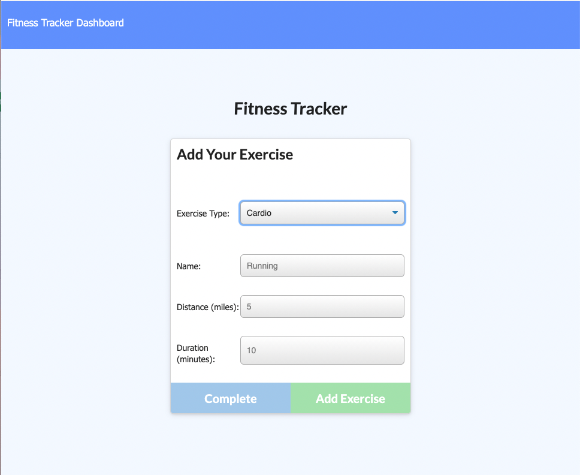
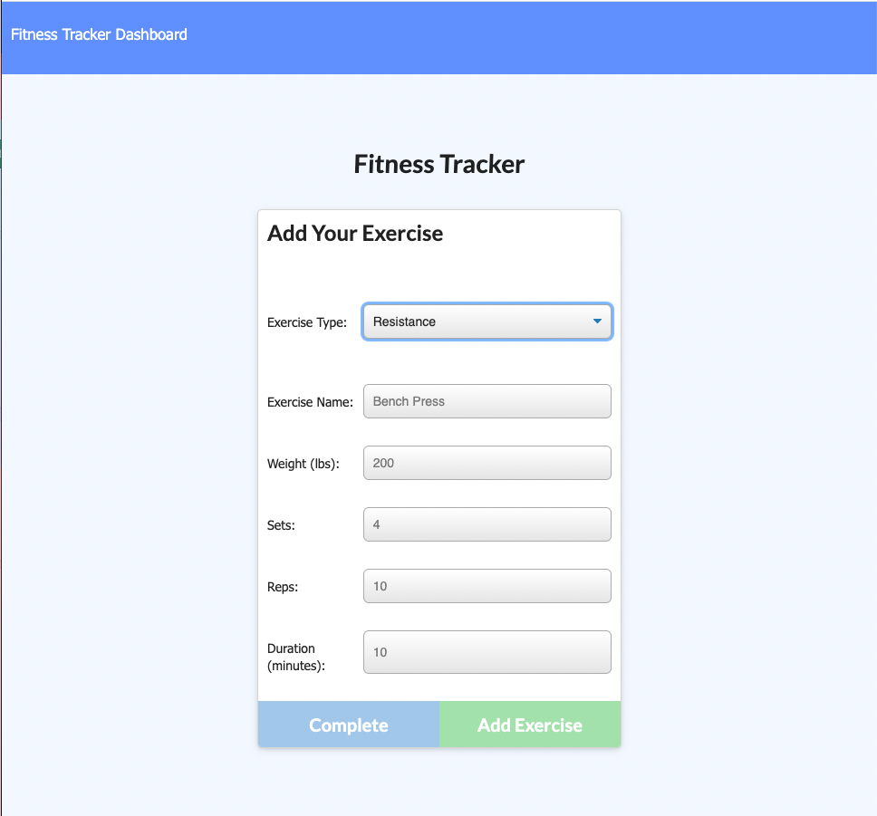
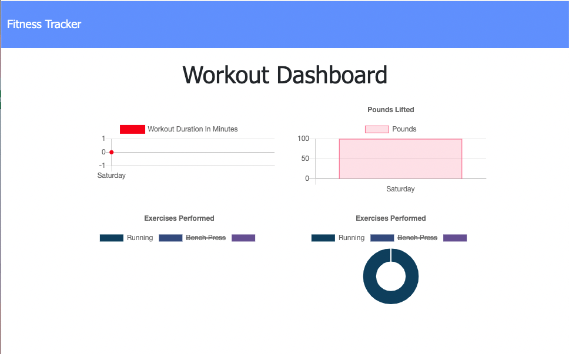

# Fitness-Tracker

## Description
This is an application that allows the user to build and track daily workouts that can include multiple exercises and the name, type, weight, sets, reps, and durations of each exercise. The front end code was already provided. 

- [Deployed Website](https://evening-cliffs-42215.herokuapp.com/)

## Images

## Technologies
- JavaScript
- Node.js
- Express.js
- Heroku 
- MongoDB
- Mongoose
- MongoDB Atlas

## Questions

If you have any questions, please contact me at https://github.com/kilaweeks or kilaweeks@gmail.com.
